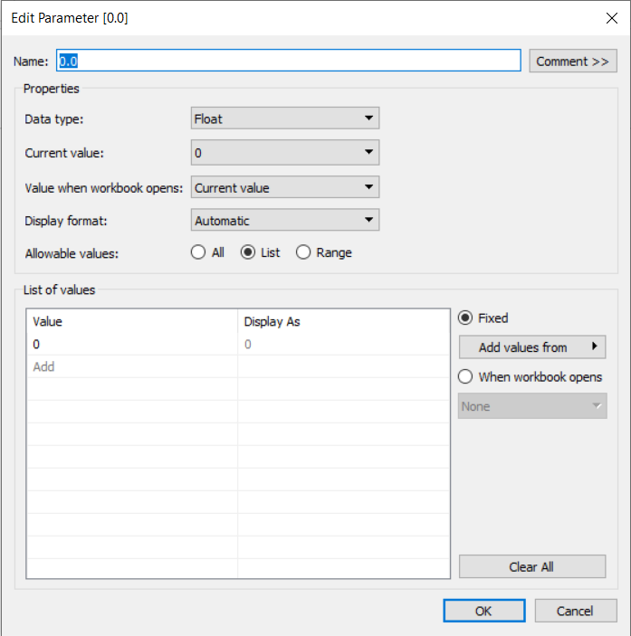

# Collapsing Menus in Tableau Dashboards
Template and instructions for creating a collapsible sidebar menu in Tableau dashboards.

## Introduction
In complex data visualizations, screen real estate is often at a premium. It is typically good practice to include an explanation of the dashboard's content and how it was intended to be used, but it is difficult to incorporate such an explanation without taking too much space away from the data. From a design point of view, a neat solution to this tradeoff is to place explanatory text in a sidebar that the user can expand when needed, and collapse when ready to focus on the data. However, Tableau does not provide a convenient way of implementing such functionality, so a workaround is necessary.

This repository contains a Tableau packaged workbook illustrating how to create a collapsible sidebar. It is based on the technique described in [this blog post](https://interworks.com/blog/rrouse/2016/01/04/creating-collapsing-menu-container-tableau). In addition to the workbook, which is meant to be a starting point for incorporating the sidebar into your own dashboards, the goal of this document is to provide a detailed walkthrough of the implementation step-by-step, filling in some of the gaps that the blog post skips over.

## Getting started
You will first need to create a new data source consisting of a single text file. The text file should contain one column, named "Toggle", and two rows, "show" and "hide". I used Excel to create this file and saved it as a CSV called `toggle.csv`.

Once you've created the file, connect to it in Tableau. From the **Data Source** screen, open the Data menu and choose New Data Source. Then select "Text File" and navigate to `toggle.csv`. Your **Data Source** screen should look something like this.

## The concept
As the blog post says, the general idea is that the dashboard will have three components laid out side-by-side. The rightmost component is the content of the dashboard itself. It can contain whatever you'd like. The center component is the sidebar. The leftmost component is a blank worksheet that is positioned off of the visible portion of the screen to the left, and can be shown or hidden when the relevant button is pressed. When it is hidden, it takes up zero horizontal space, and so the sidebar to its right becomes positioned offscreen. When it is shown, the sidebar gets pushed to the right and into the visible part of the screen, pushing the dashboard content to the right as well. This provides the "collapsible" functionality.

To get this to work, there are three components that must be set up in a very particular way. They are all worksheets, and they all connect to the `Toggle` data source described previously. The first is the blank worksheet. The other two appear to the user to be the "collapse" button and the "expand" button. These are actually worksheets, and the button-like behavior comes from a **filter action** that is created using them.

## Step 1: The show/hide sheets

1. Create a parameter named **0.0** that takes the value 0. This parameter will never be changed and is just used to correctly position the icons.
2. Drag the `Toggle` dimension into the Filters pane. Set the filter to include `show` only.
3. Drag the `Toggle` dimension onto Detail in the Marks pane.
4. Drag the **0.0** parameter into the Columns pane *twice*. Then right click on the second one and select "Dual Axis".
5. In the Marks pane, expand the mark type dropdown and select "Shape". Then click Shape and choose a shape to display. This shape is what will appear as the icon the user selects to expand the sidebar. You can upload a custom image if you'd like to use the "hamburger" three-horizontal-lines icon commonly seen on mobile websites and apps. For now, just choose the `+` shape.
6. Next we need to hide everything on the sheet except for the `+` mark itself. Right click on both the top and bottom axes and deselect "Show Header". In the Marks pane under "All", click on "Tooltip" and deselect "Show tooltips". Right click on the `+` itself and choose "Format...", then go into the Format Borders tab and set everything to "None". Do the same in the Format Lines tab.
7. Adjust the size and color of the mark to your liking.
8. You may notice that hovering over the `+` causes a thick border to appear around the shape. To prevent this from happening, the trick is to set the shape for *one* of the two parameters on the sheet to a completely transparent image. There is a 100x100 transparent image included in this repository. To use it, find the folder on your machine called "My Tableau Repository" (to find its location, open the "File" menu in Tableau and select "Repository Location..."). Open it, then open the "Shapes" folder, create a subfolder named "Custom Images" or something similar, then copy the image into that new folder. From Tableau, in the Marks pane, go to "0.0 (2)" and click Shape, then "More Shapes...". You should see the name of the folder you created in the dropdown list (if not, click "Reload Shapes" or restart Tableau and check again). Your image should appear in the box. Since it's transparent, it may not look like it's there, but if you move your mouse into the box you should be able to find it. Choose the transparent image as the shape, and the `+` mark will no longer have the border when hovering over it.
9. Rename this sheet "Show".

Now the Show sheet is all set. Rather than redoing all of the above steps to create the Hide sheet, just duplicate the Show sheet and change the mark to an `X` (don't forget to keep the "0.0 (2)" shape set to the transparent image). Also, be sure to change the filter to include `hide` only.

## Step 2: The blank sheet

1. Create a new sheet named "Blank". Drag the `Toggle` dimension to the Rows pane.
2. Duplicate the `Toggle` dimension and drag the copy to the Filters pane. Set the filter to include `show` only.
3. This sheet will never be seen by the user, so you can leave it as-is if you'd like. You can hide the text on the sheet by hiding the title, right clicking on `Toggle` in the Rows pane and deselecting "Show Header", and going to Color in the Marks pane and setting the opacity to 0.

## Step 3: The dashboard

1. Create a new dashboard and drag a `Horizontal` object onto it.
2. In the Layout tab, under Item Hierarchy, ensure the horizonal object is at the top of the hierarchy, deleting the Tiled object if necessary. The horizontal object should be floating.
3. Set the width of the horizontal object. The width should be the desired width of the dashboard plus two times the desired width of the sidebar. For example, if the dashboard size is set to Generic Desktop (1366 x 768), and you want your sidebar to be 300 pixels wide, the width of the horizontal object should be 1966 pixels. Later, the x position will be set to -300 pixels, but don't do this yet -- it's hard to get everything positioned correctly when things are off the screen, so save that step for the end.
4. Drag a `Vertical` object onto the dashboard and fix the width to the visible width of your dashboard (1,366 pixels in the example from step 3). This is where the content of your dashboard will be placed (rename this object "Content" if you'd like).
5. To the left of the content container, drag another `Vertical` object onto the dashboard. This will become the sidebar (rename this object "Sidebar). Fix the width of this object to the desired width of your sidebar. I recommend giving this object a shaded background and/or a border so it stands out from the content.
6. To the left of the sidebar, drag the `Blank` sheet onto the dashboard and make it fill the entire view (with the sheet selected, click the down arrow and choose "Fit" and then "Entire View").

(hierarchy screenshot here)

The next steps involve placement of the show/hide "buttons". Laying out dashboards properly is a very fussy process, but see the screenshot below for what the hierarchy should look like after these steps are completed.

7. Drag a `Horizontal` object into the content container and another one into the sidebar container. Drag `Blank` objects (not the sheet named `Blank`) beneath them as placeholders.
8. Inside the horizontal object in the sidebar, place the `Hide` sheet and then another blank object side by side. Hide the title of the `Hide` sheet and allow it to fill the entire view.
9. Inside the horizontal object in the content container, repeat the previous step with the `Show` sheet instead of the `Hide` sheet.

At this point the dashboard should look like this:

(progress screenshot here)

## Step 4: The show/hide action

1. With the `Blank` sheet selected, go to the "Worksheet" menu and choose "Actions...".
2. Click "Add Action" and choose "Filter".
3. Give the action a name such as "show-hide". In the source sheets section, choose the dashboard (here "Dashboard 1") from the dropdown, and make sure only "Hide" and "Show" are checked. Run the action on select. In the target sheets section, again choose the dashboard from the dropdown, and check only "Blank". Select "leave the filter" for the behavior when clearing the selection. Finally, click OK.
4. Back on the dashboard, try clicking on the `X` in the sidebar. The blank sheet on the left should disappear. Click the `+` and it should come back.

If the buttons are working, select the topmost horizontal container and set the x position to negative the width of your sidebar. This will slide everything over so that the blank sheet is invisible. Now click the `X` again and the sidebar will disappear.

## Step 5: Create your dashboard

Finally, everything is set up. Fill the content container with your visualizations just as you would with any dashboard, and fill the sidebar with instructions, filters, logos, or whatever you want.
