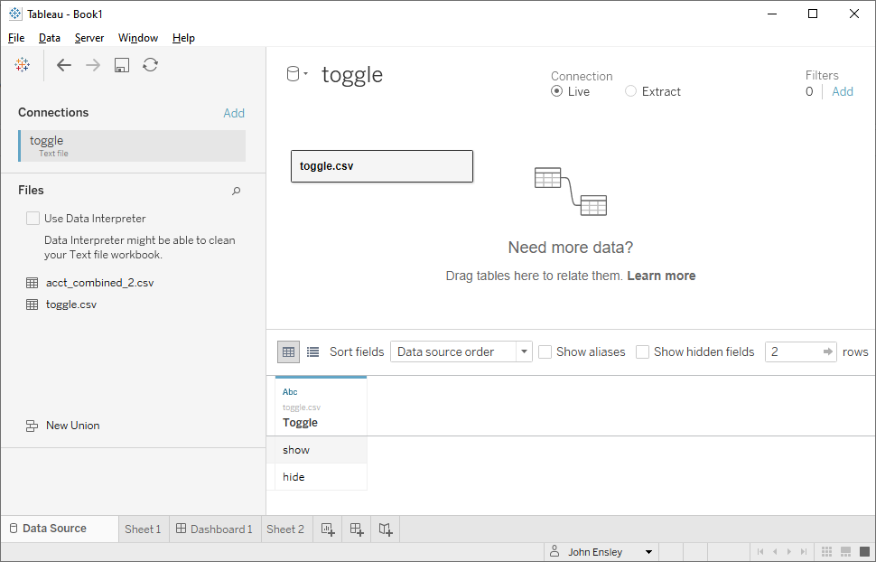

# Collapsing Menus in Tableau Dashboards
Template and instructions for creating a collapsible sidebar menu in Tableau dashboards.

## Introduction
In complex data visualizations, screen real estate is often at a premium. It is typically good practice to include an explanation of the dashboard's content and how it was intended to be used, but it is difficult to incorporate such an explanation without taking too much space away from the data. From a design point of view, a neat solution to this tradeoff is to place explanatory text in a sidebar that the user can expand when needed, and collapse when ready to focus on the data. However, Tableau does not provide a convenient way of implementing such functionality, so a workaround is necessary.

This repository contains a Tableau packaged workbook illustrating how to create a collapsible sidebar. It is based on the technique described in [this blog post](https://interworks.com/blog/rrouse/2016/01/04/creating-collapsing-menu-container-tableau). In addition to the workbook, which is meant to be a starting point for incorporating the sidebar into your own dashboards, the goal of this document is to provide a detailed walkthrough of the implementation step-by-step, filling in some of the gaps that the blog post skips over.

## Getting started
You will first need to create a new data source consisting of a single text file. The text file should contain one column, named "Toggle", and two rows, "show" and "hide". I used Excel to create this file and saved it as a CSV called `toggle.csv`.

Once you've created the file, connect to it in Tableau. From the **Data Source** screen, open the Data menu and choose New Data Source. Then select "Text File" and navigate to `toggle.csv`. Your **Data Source** screen should look something like this.

## The concept
As the blog post says, the general idea is that the dashboard will have three components laid out side-by-side. The rightmost component is the content of the dashboard itself. It can contain whatever you'd like. The center component is the sidebar. The leftmost component is a blank worksheet that is positioned off of the visible portion of the screen to the left, and can be shown or hidden when the relevant button is pressed. When it is hidden, it takes up zero horizontal space, and so the sidebar to its right becomes positioned offscreen. When it is shown, the sidebar gets pushed to the right and into the visible part of the screen, pushing the dashboard content to the right as well. This provides the "collapsible" functionality.

To get this to work, there are three components that must be set up in a very particular way. They are all worksheets, and they all connect to the `Toggle` data source described previously. The first is the blank worksheet. The other two appear to the user to be the "collapse" button and the "expand" button. These are actually worksheets, and the button-like behavior comes from a **filter action** that is created using them.
